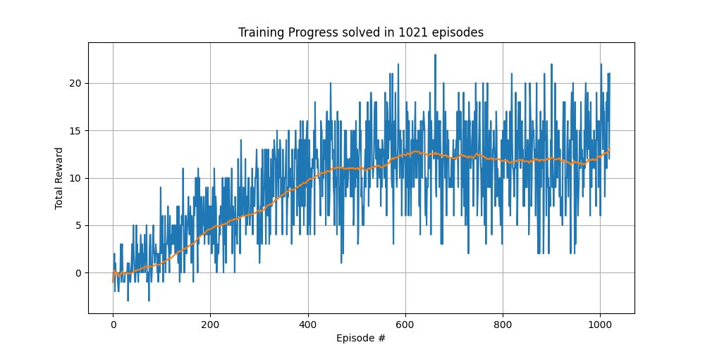
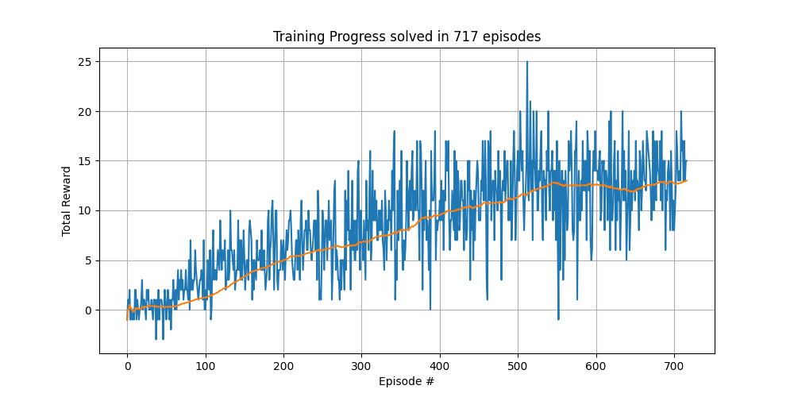
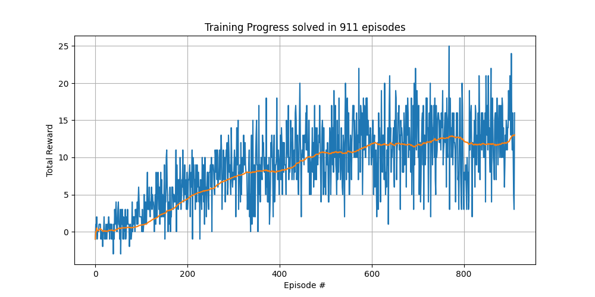
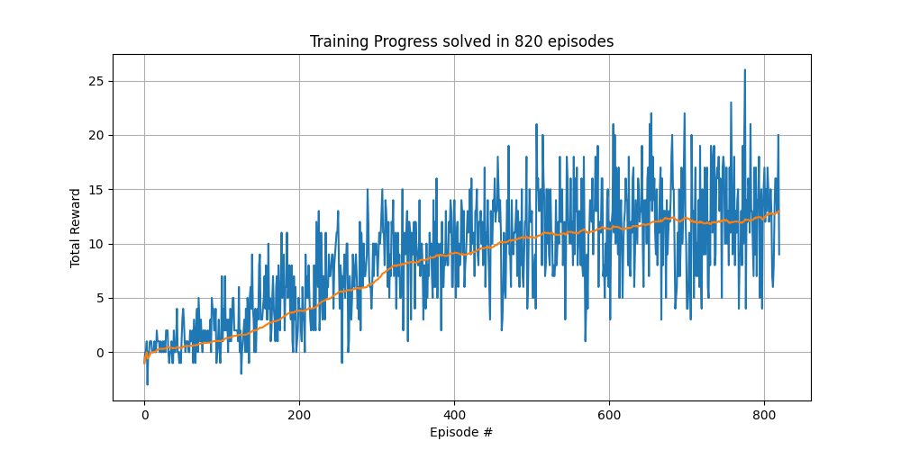
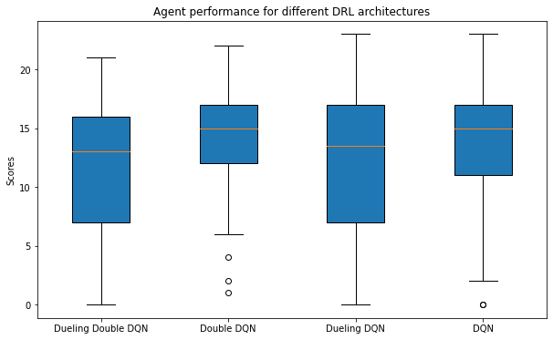

---
---

---
---

# Navigation Project Report

## Table of Contents

1. Introduction
2. Problem Definition
3. Environment Details
4. Methodology
    * Q-learning 
    * Deep Q-Networks (DQN)
    * Advanced Techniques (e.g., Dueling DQN, Double DQN)
5. Implementation
6. Experiments & Results
    * Training Process
    * Performance Metrics
    * Visualization & Analysis
7. Future Work
8.  Conclusion
9.  References
---

### **1. Introduction**

Navigation has always been an exciting challenge for reinforcement learning practitioners. In our project, we try to train an agent to accurately ascertain its position and move in a square world collecting rewards and avoiding obstacles or pitfalls. In our Banana collection environment, we focus on collecting yellow bananas to amass rewards and avoid the blue ones. 

### **2. The Environment**

#### **2.1 Background**

We are dealing with a large environment, similar to Unity's Banana Collection Environment, which is presented as a square-shaped arena. In the environment, the agent can potentially interact with two types of bananas: yellow and blue.

The agent needs to achieve a high score by **maximizing rewards** by collecting as many yellow bananas as possible and **minimizing penalty points** by avoiding blue bananas.

#### **2.2 Reward Structure**

The environment provides a clear reward/punishment system. The agent objective can be achieved by two straightforward actions:
- **Collect One Yellow Banana**: +1 point.
- **Collect One Blue Banana**: -1 point.
As mentioned in the previous section, the agent needs to find the right strategy to maximize its score.

#### **2.3 State and Action Spaces**

The agent observes its environment through a **37-dimensional state space** generated after each action taken. The state is composed of data relating to the agent's velocity as well as data on ray-based perception of nearby objects that are in front of the agent. Such a detailed perception mechanism readies the agent with an exhaustive view of its surroundings.

The agent has a set of four discrete actions at its disposal:
- **0**: Move Forward
- **1**: Move Backward
- **2**: Turn Left
- **3**: Turn Right

Given these tools, the agent must interpret the environment's characteristics and select the best actions to maximize its total reward.

#### **2.4 Success Benchmark**

The benchmark for success in this banana collection environment is to average a score of more than 13 over 100 consecutive episodes. 

## 4. Methodology
### Background:
Given an agent and an environment, the agent interacts with its environment over discretized time steps. 

Indeed, at a given time step $t$:
1. The agent observes the environment, which is represented by a vector $s_t$ from the state space $\mathcal{S}$,
2. Given a policy, the agent selects an action $a_t$ from the action space $\mathcal{A}$. 
3. The environment outputs the reward, a scalar $r_{t+1}$  from the set $\mathcal{R}$, and transitions to a new state $s_{t+1}$.

The agent follows a policy $\pi$, which maps the state space to the action space: $\pi: \mathcal{S} \rightarrow \mathcal{A}$. We usually design the policy to maximize the return:

\\[
G_t = r_{t+1} + \gamma r_{t+2} + \gamma^2 r_{t+3} + \dots = \sum_{k=0}^{\infty} \gamma^k r_{t+k+1
\\]

where $\gamma$ is a discount factor in the range $[0,1]$.

The main goal of our agent is to learn an optimal policy, however the agent:
1. Doesn't have access to the environment dynamics (MDP). 
2. Needs to strike a balance between learning more about the environment through exploration and exploiting to collect rewards.

So the question becomes, **"How can an agent learn such optimal policy?"**

### Q-Learning:
**Q-learning** is an off-policy and model-free RL algorithm that aims to learn the optimal action-value function $Q^{*}$. By doing so, the algorithm tries to find the optimal action-selection policy for an agent to maximize its expected total reward.

#### 1. Value Function:
The value function came to try and address the aforementioned challenges. $V(s)$ represents the expected cumulative reward of being at a state $s$ and following the policy $\pi$. The limitation of such a proposal resides in its lack of control over the action selection process. The agent is limited to the information about the value of being at a state $s$ while omitting the value of taking a given action $a$ in that state.

#### 2. Action-Value Function:

The action-value $Q^{\pi}(s, a)$ function represents the quality of an action taken by an agent in a given state and following the policy $\pi$. Formally, it is defined as follows:

\\[Q^{\pi}(s, a) = \mathbb{E}_{\pi} \left[ G_t | s_t = s, a_t = a \right]
\\]

In other words, it is the expected return of taking an action $a$ at a state $s$ and following the policy $\pi$.
#### 3. The Q-learning Update Rule

Q-learning, being an off-policy algorithm, the optimized policy is different from the learning one. It aims to learn the optimal $Q^*$ that is defined as:

\\[Q^*(s, a) = \max_{\pi} Q^{\pi}(s, a)\\]

For a given transition $(s, a, r, s')$, the Q-learning update is performed as:

\\[Q(s, a) \leftarrow Q(s, a) + \alpha \left[ r + \gamma \max_{a'} Q(s', a') - Q(s, a) \right]\\]

Here:
- $s$ is the current state.
- $a$ is the selected action.
- $r$ is the reward given by the environment.
- $s'$ is the next state.
- $\alpha$ is the learning rate.
  
The term $r + \gamma \max_{a'} Q(s', a')$ is the learned value or the temporal difference target. The difference between the learned value and the old value,  $\delta = r + \gamma \max_{a'} Q(s', a') - Q(s, a)$, is referred to as the temporal difference error.

#### 4. **Exploration-Exploitation Dilemma**
Exploration is essential for the agent to discover all the potential rewards in an environment and avoid premature optimization which could lead to sub-optimal policies. On another hand, the exploitation, achieved through the known Q-values, is used to avoid deviating from known good decisions. So, we need to strike a balance between exploration and exploitation, for that Q-learning is using the $\epsilon$-greedy strategy. Following this strategy, the agent chooses a random action (exploration) with probability $\epsilon$ and chooses a greedy action (exploitation) with probability $1-\epsilon$. As the learning process progresses, we decay the $\epsilon$ to privilege exploitation, given that the agent has progressively a better knowledge about its environment.

#### 5. **Why Q-learning?**

We need to choose an RL algorithm that suits well the characteristics of the environment to solve, and therefore has the following aspects:

1. **Sparse Rewards:** The rewards can be sparse in the Banana Collector environment. A value-based method such as Q-learning tries to propagate the value of rewarding states backward to preceding states, making it resilient to reward sparsity (to a certain extent).
2. **Delayed Rewards:** In some cases, an agent might take action that at first seems nonproductive, but might prove to be reaping larger rewards. For instance, the agent might move away from a visible banana to avoid transitioning into a less profitable state. The recursive nature of Q-learning makes it capable of accounting for future rewards as well. Q-leaning not only takes into account the immediate rewards but also the future potential rewards and therefore helps with delayed rewards issues.
3. **Continuous State Space with Discrete Actions:** As shown earlier, the banana collection environment provides the agent with a partial observation of the environment facing it. The generated state is a high-dimensional continuous state space generated from ray-based perception while the action space is limited to 4 discrete commands (move forward, backward, turn left, right).  Q-learning readily handles discrete action spaces, as for the continuous state space it can be handled through a function approximator such as Deep Q Networks (DQN) which allows to generalize to unseen similar states.
4. **Dynamic Environment:** The studied environment is dynamic and changes over the same episode or different episodes. Given that Q-learning is model-free, it doesn't require knowledge of the environment. It learns through the value of action at given states based on accumulated experiences and can adapt to the dynamic nature of the environment.

Given these characteristics, **Q-learning**, especially its deep variant (DQN), is suitable to master the challenges posed by the Banana Collector environment.

### Deep Q-Networks (DQN)
Given the complexity of our Banana collection environment, we cannot directly apply Q-learning. Classical Q-learning relies on a tabular approach, where each state-action combination is recorded. However, this becomes untenable when your state space is high-dimensional. Therefore, we need to use a function approximator to map our continuous state space to our discrete action space, which dramatically reduces the needed memory footprint. Furthermore, with the rise of deep learning, we can approximate any function as long as the neural network is properly dimensioned, which opens the door to more accurate state space modeling. This approach is called Deep Q-Networks (DQN).

In **DQN**, a deep neural network is used to approximate the action-value function:

\\[Q(s, a; \theta) \approx Q^*(s, a)\\]

where $\theta$ represents the parameters of the neural network.

#### Architectural Details

While using deep learning to solve our curse of dimensionality in our state space, applying it naively would not lead to satisfactory results. The issue resides in the fundamental differences in the data generated by the environment and the data used to train the classical supervised models. Formally, the challenges are as follows:
1. **Non-stationarity of Data:**  The generated data distribution continually evolves with the agent's policy. Supervised learning for classical deep learning problems assumes a static dataset which contrasts with the dynamic nature of RL data.
2. **Temporal dependence:** In RL the data is successively generated and strongly temporally correlated. The generated data therefore violates the i.i.d assumption which is essential for efficient training in deep learning (mainly due to the optimizer).
3. **Feedback loop:** In supervised learning, the training samples are independent of the model output. However, in RL the agent's actions (policy) influence the generated data.
   
To overcome these issues, **DQN** has introduced two essential architectural components:
1. **Experience Replay:** A buffer to store the agent's experiences. DQN randomly samples experiences from the replay buffer during training/learning phases, which breaks the correlation and provides the essential i.i.d condition. By adopting the replay buffer component DQN addresses both the data non-stationarity and temporal correlation.
2. **Target Network:** During learning, if we use the same network for estimating the $Q$ value of the next state, we will have oscillation and convergence issues. It is similar to learning to shoot at a moving target, which greatly hinders the learning process. To mitigate this issue, DQN introduces the concept of the target network. It is a secondary network, periodically updated, that serves a stable target for the main network. To update the target network, we copy the weights of the main network into the target network. 

### Advanced Techniques
**DQN** has proven to be efficient in solving complex environments, especially video games such as Atari. However, **DQN** is not without its challenges, especially in terms of potential bias and variance in Q-value estimation. In this section, we will present two **DQN** extension proposals that came to answer these challenges.

#### Bias Mitigation (Double DQN)
When deep learning was introduced to Q-learning through **DQN**, it was shown to be highly susceptible to optimistic overestimation of Q-values, especially in high-variance environments. A direct consequence of using the max operator during the action selection process, coupled with the usage of the same weights for both action selection and its Q-value evaluation.

**Double DQN** was introduced to mitigate this issue by decoupling the action selection from its evaluation (corresponding Q-value):

\\[\mathcal{L}(\theta) = \mathbb{E} \left[ \left( r + \gamma Q(s', \arg\max_{a'} Q(s', a'; \theta); \theta^-) - Q(s, a; \theta) \right)^2 \right]\\]

1. **Action Selection**: We use the main network to select the action $a'$ that maximizes the Q-value for the next state $s'$, $\arg\max_{a'} Q(s', a'; \theta)$.
2. **Q-value Evaluation**: Using the selected action $a'$, we use a stable network such as the target network to evaluate its Q-value, $Q(s', \arg\max_{a'} Q(s', a'; \theta); \theta^-)$.

By following this procedure, **DDQN** mitigates the bias due to overestimation, which promotes more robust learning.

#### Variance Reduction (Dueling DQN)
While DQN provides robust performance, its architecture confounds the state and the action. There might exist some cases where the value of the state trumps the value of each possible action, and therefore knowing the value of the state is sufficient. In other words, these types of states don't require an in-depth action-value distinction as all the possible actions would lead to the same outcome.

Based on this observation, **Dueling DQN** decouples the state-value function $V(s)$ from the state-dependant action advantage $A(s,a)$. So, instead of approximating the $Q$ function directly, we decompose its computation into two streams/networks as follows:
\\[Q(s, a; \theta, \alpha, \beta) = V(s; \theta, \beta) + \left( A(s, a; \theta, \alpha) - \frac{1}{|A|}\sum_{a'} A(s, a'; \theta, \alpha) \right)\\]

The architecture is composed of:
1. A common feature extraction module.
2. A stream to compute $V(s)$ from the extracted features and outputs a single value.
3. A stream to compute $A(s,a)$ from the extracted features which outputs a value for each action.

A baseline term, the average advantage, is subtracted from the advantage to stabilize the training.
By adopting this strategy, **Dueling DQN** is able to:
1. Reduce variance on the Q-value predictions, 
2. Learn more nuanced policies and improve policies
3. Converge faster.

In the next section, we will present how we implemented out system.

## 5. Implementation

### Software & Tools

- **Numpy v1.23.1:** Utilized for numerical operations.
- **PyTorch v1.8.0a0:** Facilitated neural network construction and training, offering deep learning support.
- **unityagents v0.4.0**: Interface for interacting with the Unity environment.
- **Unity**: Hosted the Banana environment for agent training and evaluation.
- **Jupyter Notebook**: `Navigation_DuelingDDQN_Testing.ipynb` provides testing and visualization, leveraging Jupyter's interactivity.

### Neural Architectures:

**QNetwork**:
  - **Input**: Matches the environment's state dimensions.
  - **Hidden Layers**: Two layers with sizes [128, 64], both using ReLU activation.
  - **Output**: Corresponds to the number of actions, signifying Q-values.

**DuelingQNetwork**:
  - **Input**: Equates to the environment's state size.
  - **Hidden Layers**: Sizes [128, 64] with ReLU activations.
  - **Value Stream**: Outputs the state's value through a single node.
  - **Advantage Stream**: Outputs action advantages, matching the action space's dimensionality.
  - **Q-value Synthesis**: 
    $$Q(s,a) = V(s) + (A(s,a) - mean(A(s,all\_actions)))$$

### Experience Replay:
- Uses a buffer with `BUFFER_SIZE = 10000`. Samples `BATCH_SIZE = 64` experiences per update.

### Agents:

**DQNAgent**:
- Adopts `GAMMA = 0.99` as the discount factor.
- Uses `TAU = 1e-3` for soft updates.
- Schedules target network updates every `UPDATE_EVERY = 4` steps.
- Employs an epsilon-greedy mechanism for action selection.

**DoubleDQNAgent**:
- Inherits DQNAgent properties with added Double Q-learning for Q-value target generation.

### Optimization:
- Incorporates Adam optimizer, set with `LEARNING_RATE = 1e-3`.

### Training Approach:
- Periodically samples from stored experiences to iteratively hone the agent's policy, using the Bellman equation.

### Exploration Strategy:
- Adopts epsilon decay, promoting an exploration-exploitation trade-off.

### Codebase Structure

- **`Banana.app`**: Unity environment.
- **`agent.py`**: Centralizes agent's functionalities.
- **`env.py`**: Handles interfacing with the Unity environment.
- **`figures`**: Repository for visual analytics of the agent's performance.
- **`main_runner.py`**: The central hub for invoking training and testing phases.
- **`model.py`**: Houses neural network designs, spanning DQN, Dueling DQN, and Double DQN.
- **`models`**: Preserves trained neural weights. Naming conventions like `navigation_dqn_dueling_True_double_False.pth` distinctly pinpoint configuration details.
- **`train.py`**: Manages training routines.

## 6. Experiments & Results

### Training Process

For solving our Banana collection environment, we have experimented with the DRL algorithms mentioned above, namely DQN, Double DQN, Dueling DQN, and Dueling Double DQN. We use an $\epsilon$-greeedy strategy for our exploration, the $\epsilon$ factor is decayed gradually as the agent learns more about the environment. The decay is carried from $1$ with a rate of $0.995$ until we read a minimum at $0.01$. This strategy has proven to be efficient in striking a balance between exploration and exploitation.

We train our agents over a maximum of $2000$ episodes, and each episode is limited to $100000$-time steps or when the environment sends a done signal, whichever is sooner. For each episode, the rewards are aggregated over the timesteps to measure the performance of the agent. We periodically train our agent, every $4$ steps, on a batch of experiences of size $64$. The learning rate is limited to $1e-3$ and we set the discount factor `GAMMA` to $0.99$.

### Performance Metrics

To measure the performance of our agent, we choose to compute the **cumulative reward per episode**. This metric is aligned with the objective of the agent, which is to achieve the highest score possible by collecting the yellow bananas and avoiding the blue ones. By using this metric we assess the quality of the learned policy of an agent, in terms of navigation and banana collection.

Furthermore, as per the directives of the project, to solve our environment we need to track the **rolling average of the cumulative reward** over 100 episodes. It is a relevant metric as it helps to smooth the performance curve and gives you more confidence when judging the agent's performance. The environment is considered solved when this metric crosses the score of 13. 

### Visualization & Analysis

#### Training Dynamics:

<table>
  <tr>
    <td align="center"> <i>Training progress for DQN Agent (Solved in 1021 eps).</i></td>
    <td align="center"> <i>Training progress for Double DQN Agent (Solved in 717 eps).</i></td>
  </tr>
  <tr>
    <td align="center"> <i>Training progress for Dueling DQN Agent (Solved in 911 eps).</i></td>
    <td align="center"> <i>Training progress for Dueling Double DQN Agent (Solved in 820 eps).</i></td>
  </tr>
</table>

In the above figure, we provide the different agents' performance graphs representing the training progress in relation to the total episode reward. When analyzing the graphs, we can make the following observations:
1. **Fast Initial Progress**: The agents, in all the present architectures, have shown a rapid assimilation of navigation skills and reward collection.
2. **Plateauing and inflection points:** During the learning process the agents encounter plateaus and some regressions. This could indicate the issue related to the complexity of the Q-value estimation (bias). 
3. **Convergence** While we stopped our training after achieving the target score of 13, we can clearly see that the agent is mastering its environment.

It is clear from the figures above that the Double DQN is the best-performing DRL architecture as it solves the environment in 717 episodes.

#### Efficacy of Agent's Policy:

  
   
  <i>Agent performance for different DRL architectures</i>

After evaluating the efficiency of the training progress for each DRL architecture, we evaluate the quality of the agent's policy. From the boxplot above we make the following interpretation:
1. **Dueling Double DQN:** The combination of Double and Dueling components was at first expected to give the best performance among all the other combinations. However, in this Banana Collection environment, we have a mean total reward of $11.59$ with high variability (SD of  $5.61$).  This could potentially indicate that this combination introduces volatility and instability to our agent's performance.
2. **Double DQN:** This architecture gives the highest mean total reward of $13.99$ and the lowest variability (SD of $4.12$). This confirms the ability of DDQN to reduce over-estimation in Q-values and therefore the incurred bias. The consistency of the agent's performance is a great indication of the quality of its policy
3. **Dueling DQN:**  This architecture gives the third-highest mean total reward of $12.16$ but has the highest variability (SD of $6.55$).  The theoretical potential gain in policy quality by enhancing the action-value representation using the dueling architecture is not concretized in our environment.
4. **Vanilla DQN:** Surprisingly, the vanilla DQN has the second-best performance with a mean total reward of $13.35$ and a standard deviation of $4.99$. This shows that different mechanisms might work in different environments, which imposes the necessity to try different architectures

**Overall Observations**: 
1. The clear winner here is the Doule DQN architecture, which showed the best performance in terms of average score, consistency, and convergence speed
2. While the combination of mechanisms could lead in general to better performance, it is shown in our case that it is not always the case. The DRL practitioner needs to try different architectures according to the nature and the complexity of the environment at hand.

## 8. Future Work
While the results obtained from our experimentations led to solving the environment by achieving the necessary cumulative score, the ever-evolving field of deep reinforcement learning provides a large panel of techniques to explore. Given this context, we assume that the agent's policy can still be further refined and improved. Therefore, we can propose several avenues to explore:
1. **PER (Prioritized Experience Replay):** By adding a priority for each experience based on TD-error, the agent we be served with the samples that he can improve the most from. We introduce an importance hierarchy in the sample selection to refine the learning process.
2. **Distributional DQN**: While Vanilla DQN relies on estimating a single Q value for each state, Distributional DQN proposes to estimate the Q-value distribution instead. This would lead to more robust policies by taking into account the potential stochasticity of the environment.
3. **Advantage Actor Critic (A2C) and Proximal Policy Optimization (PPO)**: While we have focused on value-based techniques as a proxy for generating the agent's policy, we can try estimating the policy directly through policy-gradient methods. They offer alternative paradigms for learning, and trying them on our problem might lead to interesting results.

## 9. Conclusion
In this study, we have explored and studied some of the most prominent state-of-the-art DRL architectures that could construct an agent capable of solving our Banana collection environment. While some advanced techniques presented subpar performances in contrast with some simpler counterparts, Double DQN has proven to be the most capable solution. In our endeavor, we have shown the performance of DRL techniques to solve difficult and complex environments such as the Banana Collection environment, but also the undeniable potential of the ever-evolving DRL to solve real-world problems.

## 10. References

1. Wang, Z., Schaul, T., Hessel, M., van Hasselt, H., Lanctot, M., & de Freitas, N. (2016). Dueling Network Architectures for Deep Reinforcement Learning. arXiv preprint [arXiv:1511.06581](https://arxiv.org/abs/1511.06581).

2. van Hasselt, H., Guez, A., & Silver, D. (2015). Deep Reinforcement Learning with Double Q-learning. arXiv preprint [arXiv:1509.06461](https://arxiv.org/abs/1509.06461).

3. Mnih, V., Kavukcuoglu, K., Silver, D., Graves, A., Antonoglou, I., Wierstra, D., & Riedmiller, M. (2013). Playing Atari with Deep Reinforcement Learning. arXiv preprint [arXiv:1312.5602](https://arxiv.org/abs/1312.5602).

4. Schaul, T., Quan, J., Antonoglou, I., & Silver, D. (2016). Prioritized Experience Replay. arXiv preprint [arXiv:1511.05952](https://arxiv.org/abs/1511.05952).

5. Bellemare, M. G., Dabney, W., & Munos, R. (2017). A Distributional Perspective on Reinforcement Learning. arXiv preprint [arXiv:1707.06887](https://arxiv.org/abs/1707.06887).

6. Schulman, J., Wolski, F., Dhariwal, P., Radford, A., & Klimov, O. (2017). Proximal Policy Optimization Algorithms. arXiv preprint [arXiv:1707.06347](https://arxiv.org/abs/1707.06347).

7. Mnih, V., Puigdomènech Badia, A., Mirza, M., Graves, A., Lillicrap, T. P., Harley, T., Silver, D., & Kavukcuoglu, K. (2016). Asynchronous Methods for Deep Reinforcement Learning. arXiv preprint [arXiv:1602.01783](https://arxiv.org/abs/1602.01783).

8. [Unity Technologies](https://unity.com/).

9. [Udacity](https://www.udacity.com/).

